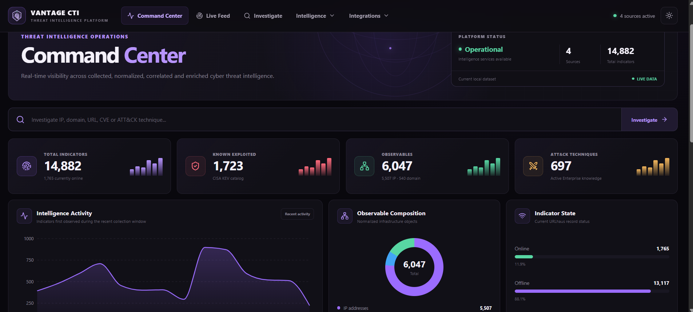

<div align="center">

# ◈ VANTAGE CTI

### Threat Intelligence. Correlated. Enriched. Actionable.

**A vendor-neutral Cyber Threat Intelligence platform built to transform fragmented threat data into an analyst-focused intelligence workspace.**

<br>

[](https://www.python.org/)
[](https://fastapi.tiangolo.com/)
[](https://www.postgresql.org/)
[](https://react.dev/)
[](https://vite.dev/)

<br>

[Overview](#-what-is-vantage-cti) •
[Command Center](#-command-center) •
[Intelligence](#-intelligence-workspaces) •
[Architecture](#-architecture) •
[Data Sources](#-intelligence-sources) •
[API](#-api) •
[Roadmap](#-roadmap)

</div>

---

## 👁️ What is VANTAGE CTI?

Threat intelligence rarely arrives in one place.

Indicators come from feeds.  
Vulnerabilities come from separate catalogs.  
Infrastructure context lives somewhere else.  
ATT&CK knowledge has to be searched independently.  
Security analysts then have to manually connect everything.

**VANTAGE CTI is being built to change that workflow.**

It provides a centralized intelligence layer that can:

```text
COLLECT  →  NORMALIZE  →  CORRELATE  →  ENRICH
                ↓
          INVESTIGATE
                ↓
            ANALYZE
                ↓
         OPERATIONALIZE
```

Rather than presenting another collection of disconnected feeds, VANTAGE focuses on the **relationships between intelligence objects**.

An IP can lead to infrastructure context.

A domain can reveal related malicious URLs.

An indicator can expose recurring malware characteristics.

A CVE can be investigated alongside known-exploited vulnerability intelligence.

An ATT&CK technique can provide behavioral context.

The goal is simple:

> **Give analysts a better vantage point over the threat landscape.**

---

## 🖥️ Command Center

The Command Center provides an immediate operational view of the intelligence currently available to the platform.

<p align="center">
  
</p>

It brings together platform telemetry including:

- collected threat indicators
- known exploited vulnerabilities
- active MITRE ATT&CK techniques
- correlated observables
- IP enrichment coverage
- indicator status distribution
- infrastructure distribution
- top intelligence tags
- highly referenced observables
- recent collection activity

The dashboard is designed as an **entry point into investigation**, rather than a static statistics page.

---

## 🔎 Unified Investigation

VANTAGE provides a single investigation interface for multiple intelligence object types.

Enter an observable or intelligence identifier:

```text
176.65.134.121
example.com
https://example.com/payload
CVE-2021-44228
T1059
```

The platform identifies the object type and routes the investigation to the appropriate intelligence dataset.

### Currently supported

| Object | Intelligence |
|:---|:---|
| 🌐 IP Address | Observable correlation + infrastructure enrichment |
| 🔗 Domain | Related indicator intelligence |
| 🌍 URL | URLhaus indicator intelligence |
| 🛡️ CVE | CISA Known Exploited Vulnerabilities |
| ⚔️ ATT&CK ID | MITRE ATT&CK technique intelligence |

This allows analysts to move from a raw observable to contextual intelligence without switching between multiple tools.

---

## 📡 Live Intelligence Feed

VANTAGE combines intelligence from different sources into a chronological feed.

The feed currently brings together:

**URLhaus**
- malicious URL observations
- indicator status
- malware-related tags
- host correlation
- first/last seen information

**CISA KEV**
- newly cataloged exploited vulnerabilities
- affected vendors
- affected products
- vulnerability descriptions
- catalog dates

Analysts can filter and pivot directly from feed entries into investigation.

---

## 🧭 Intelligence Workspaces

VANTAGE is organized around dedicated analyst workspaces rather than one oversized dashboard.

### 🔬 IOC Explorer

Browse and filter collected indicators using:

- status
- malware family
- normalized tags
- source information
- indicator type

Any IOC can become the starting point of an investigation.

### 🦠 Malware Intelligence

Explore malware-related intelligence derived from collected indicators.

The workspace surfaces:

- recurring malware tags
- malware families
- associated indicators
- indicator activity
- common characteristics

### 🌐 Infrastructure Intelligence

Infrastructure observations are extracted and correlated from threat intelligence.

Current observable types include:

```text
IP Address
Domain
```

IP observables are enriched with contextual metadata including:

- country
- continent
- ASN
- autonomous system name
- associated domain

> Infrastructure metadata provides context about where observed infrastructure is hosted. It does **not** imply that a country, ASN, provider, or all infrastructure belonging to it is malicious.

### 🛡️ Vulnerability Intelligence

VANTAGE integrates the **CISA Known Exploited Vulnerabilities Catalog** to distinguish vulnerabilities known to have been exploited in the wild.

Analysts can browse:

- CVE identifiers
- vendors
- products
- vulnerability names
- descriptions
- catalog dates

### ⚔️ MITRE ATT&CK

Enterprise ATT&CK knowledge is available directly inside the platform.

VANTAGE currently stores:

- techniques
- sub-techniques
- tactics
- platforms
- descriptions
- active/revoked/deprecated state
- MITRE references

Techniques can be searched by ID, name, tactic, platform, or sub-technique status.

---

## 🔗 Correlation Engine

One of the central ideas behind VANTAGE is that intelligence objects should not exist in isolation.

For example:

```text
                ┌──────────────────────┐
                │      Indicator       │
                │  Malicious URL / IOC │
                └──────────┬───────────┘
                           │
                    references / hosts
                           │
                ┌──────────▼───────────┐
                │      Observable      │
                │      IP / Domain     │
                └──────────┬───────────┘
                           │
                       enriched by
                           │
                ┌──────────▼───────────┐
                │ Infrastructure Data  │
                │ ASN • Country • Org  │
                └──────────────────────┘
```

VANTAGE maintains relationships between indicators and normalized observables.

This makes questions such as these possible:

> How many indicators reference this IP?

> Which malicious URLs were associated with this domain?

> What statuses and threat types occur around this observable?

> Which tags appear most frequently across its related indicators?

That relationship layer is the foundation for deeper intelligence correlation planned for future versions.

---

## 🌍 Infrastructure Enrichment

VANTAGE currently uses **IPinfo** to enrich IP observables.

Enrichment information is stored separately from the original intelligence so that **source intelligence and contextual enrichment remain distinct**.

```text
Observable
    │
    ├── IP address
    │
    ├── First observed
    ├── Last observed
    │
    └── Enrichment
           ├── ASN
           ├── AS Name
           ├── AS Domain
           ├── Country
           └── Continent
```

This distinction is important:

**Infrastructure location ≠ malicious reputation.**

VANTAGE treats enrichment as investigation context rather than a threat verdict.

---

## 🪟 Microsoft Security

VANTAGE includes a Microsoft Security workspace designed to bridge external threat intelligence with security operations.

Current functionality includes an analyst-oriented hunting workspace capable of preparing intelligence for Microsoft security workflows.

The interface is designed around future integration with technologies such as:

- Microsoft Defender XDR
- Microsoft Sentinel
- Microsoft Graph
- Advanced Hunting
- KQL-based investigation

### KQL preparation

VANTAGE can prepare investigation queries based on observable type, helping analysts move from external intelligence into hunting workflows.

```text
VANTAGE Intelligence
        ↓
Observable
        ↓
Microsoft Security Workspace
        ↓
KQL Hunting
        ↓
Defender XDR / Sentinel
```

Direct tenant connectivity is part of the planned integration roadmap.

---

## 🧠 Intelligence Sources

VANTAGE deliberately separates **collection**, **normalization**, **correlation**, and **enrichment**.

| Source | Role | Intelligence |
|:---|:---|:---|
| **URLhaus** | Threat feed | Malicious URLs and malware-related indicators |
| **CISA KEV** | Vulnerability intelligence | Known exploited vulnerabilities |
| **MITRE ATT&CK** | Behavioral knowledge | Techniques, sub-techniques, tactics and platforms |
| **IPinfo** | Enrichment | ASN and geographic infrastructure context |

VANTAGE is designed to remain **vendor-neutral**, allowing additional intelligence providers to be integrated later.

---

## 🏗️ Architecture

```text
                       ┌──────────────────────────┐
                       │   Intelligence Sources   │
                       └────────────┬─────────────┘
                                    │
          ┌─────────────────────────┼──────────────────────────┐
          │                         │                          │
     ┌────▼─────┐              ┌────▼─────┐             ┌──────▼──────┐
     │ URLhaus  │              │ CISA KEV │             │ MITRE ATT&CK│
     └────┬─────┘              └────┬─────┘             └──────┬──────┘
          │                         │                          │
          └─────────────────────────┼──────────────────────────┘
                                    │
                           ┌────────▼────────┐
                           │   Collectors    │
                           └────────┬────────┘
                                    │
                           ┌────────▼────────┐
                           │ Normalization   │
                           └────────┬────────┘
                                    │
                           ┌────────▼────────┐
                           │  Correlation    │
                           └────────┬────────┘
                                    │
                    ┌───────────────▼────────────────┐
                    │          PostgreSQL            │
                    │                                │
                    │ Indicators      Vulnerabilities│
                    │ Observables     Relationships  │
                    │ ATT&CK          Enrichments    │
                    └───────────────┬────────────────┘
                                    │
                              ┌─────▼─────┐
                              │  FastAPI  │
                              └─────┬─────┘
                                    │
                         ┌──────────▼──────────┐
                         │   VANTAGE Web UI    │
                         │   React + Vite      │
                         └─────────────────────┘
```

---

## ⚙️ Technology Stack

### Backend

```text
Python 3
FastAPI
PostgreSQL
Psycopg
Requests
```

### Frontend

```text
React
Vite
Lucide
Recharts
```

### Intelligence

```text
URLhaus
CISA KEV
MITRE ATT&CK
IPinfo
```

---

## 🔌 API

VANTAGE exposes its intelligence through a REST API.

Some of the available endpoints include:

```http
GET /api/v1/dashboard/summary
GET /api/v1/dashboard/intelligence

GET /api/v1/feed

GET /api/v1/indicators
GET /api/v1/indicators/lookup

GET /api/v1/observables
GET /api/v1/observables/lookup

GET /api/v1/vulnerabilities
GET /api/v1/vulnerabilities/{cve_id}

GET /api/v1/attack/techniques
GET /api/v1/attack/techniques/{attack_id}

GET /api/v1/investigate?q={observable}
```

FastAPI also provides interactive API documentation while the backend is running:

```text
http://127.0.0.1:8000/docs
```

---

## 🚀 Running VANTAGE

### 1. Clone

```bash
git clone https://github.com/ranimhassine/VantageCTI.git
cd VantageCTI
```

### 2. Create the Python environment

```bash
python -m venv .venv
```

Windows:

```powershell
.\.venv\Scripts\Activate.ps1
```

Install dependencies:

```bash
pip install -r requirements.txt
```

### 3. Configure PostgreSQL

Create the database and apply:

```text
database/schema.sql
```

Create a local `.env` containing the required database and enrichment configuration.

> `.env` is intentionally excluded from Git and should never be committed.

### 4. Start the API

```bash
uvicorn main:app --reload
```

Backend:

```text
http://127.0.0.1:8000
```

### 5. Start the frontend

```bash
cd frontend
npm install
npm run dev
```

Frontend:

```text
http://localhost:5173
```

---

## 🗺️ Roadmap

VANTAGE is under active development.

Planned areas include:

- [x] URLhaus ingestion
- [x] CISA KEV ingestion
- [x] MITRE ATT&CK ingestion
- [x] Observable extraction
- [x] Indicator ↔ observable correlation
- [x] IP infrastructure enrichment
- [x] Unified investigation
- [x] Live intelligence feed
- [x] IOC Explorer
- [x] Infrastructure intelligence
- [x] Malware intelligence workspace
- [x] Analytics workspace
- [x] Dark / light interface
- [x] Microsoft Security hunting workspace
- [ ] Hash intelligence
- [ ] Expanded domain enrichment
- [ ] Relationship graph / visual explorer
- [ ] Threat scoring and confidence model
- [ ] ATT&CK correlation
- [ ] Microsoft Defender XDR integration
- [ ] Microsoft Sentinel integration
- [ ] STIX 2.1 support
- [ ] Intelligence export / reporting
- [ ] Scheduled collection
- [ ] Authentication and analyst workspaces

---

## 🧭 Design Principles

VANTAGE is being developed around several principles:

**Context over volume**  
More indicators do not automatically mean better intelligence.

**Relationships over isolated records**  
The value of an observable increases when its connections can be understood.

**Source transparency**  
Intelligence should retain its origin and should not silently become a platform-generated claim.

**Enrichment is not reputation**  
Geography, hosting providers, and ASNs provide context—not automatic maliciousness.

**Analyst-first workflows**  
Information should lead naturally from discovery → investigation → hunting.

**Vendor-neutral intelligence**  
The core intelligence layer should remain useful independently of any particular security ecosystem.

---

## ⚠️ Project Status

> **VANTAGE CTI is currently an actively developed project and should not yet be treated as a production threat-intelligence or automated blocking system.**

Intelligence from external sources should always be evaluated in its original context before operational security decisions are made.

---

## 🤝 Contributing

Ideas, issues, feedback, and contributions are welcome.

Areas particularly interesting for future development include:

- additional intelligence feeds
- enrichment providers
- correlation strategies
- ATT&CK mapping
- graph analysis
- threat hunting integrations
- STIX/TAXII interoperability
- Microsoft Security integrations

---

## 📚 Intelligence Source Attribution

VANTAGE builds on intelligence and knowledge made available by:

- **abuse.ch URLhaus**
- **Cybersecurity and Infrastructure Security Agency (CISA)**
- **MITRE ATT&CK**
- **IPinfo**

VANTAGE is an independent project and is not affiliated with or endorsed by these organizations.

Microsoft Security functionality and references are independent integrations and do not imply affiliation with or endorsement by Microsoft.

---

<div align="center">

### ◈ VANTAGE CTI

**See the relationships. Understand the context. Investigate with a better vantage point.**

<br>

Built for threat intelligence exploration, correlation and investigation.

</div>
